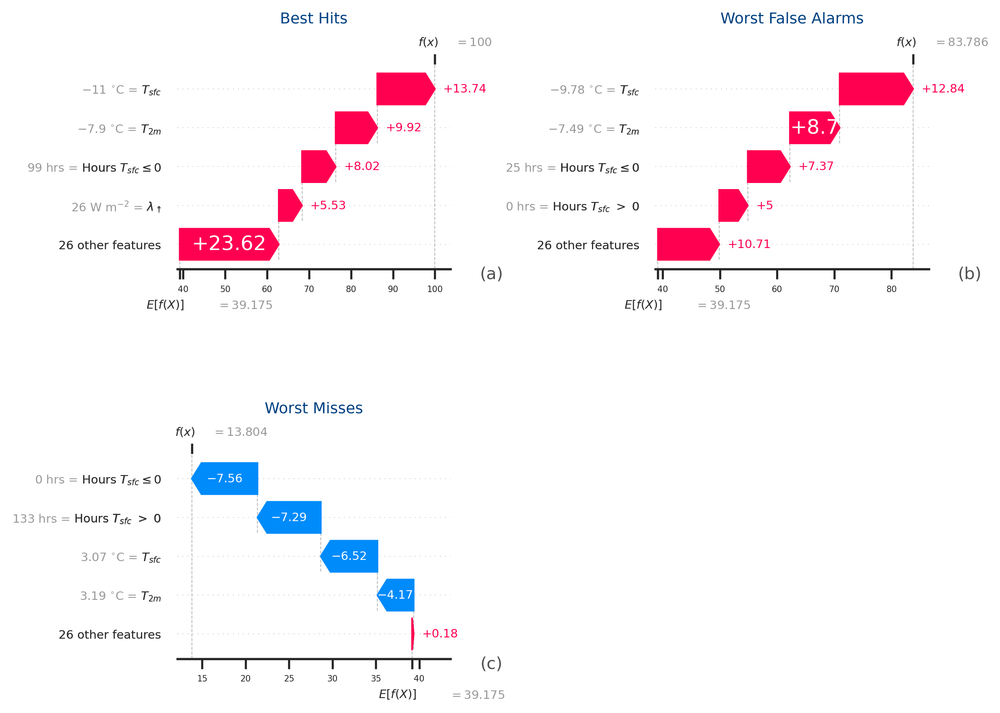
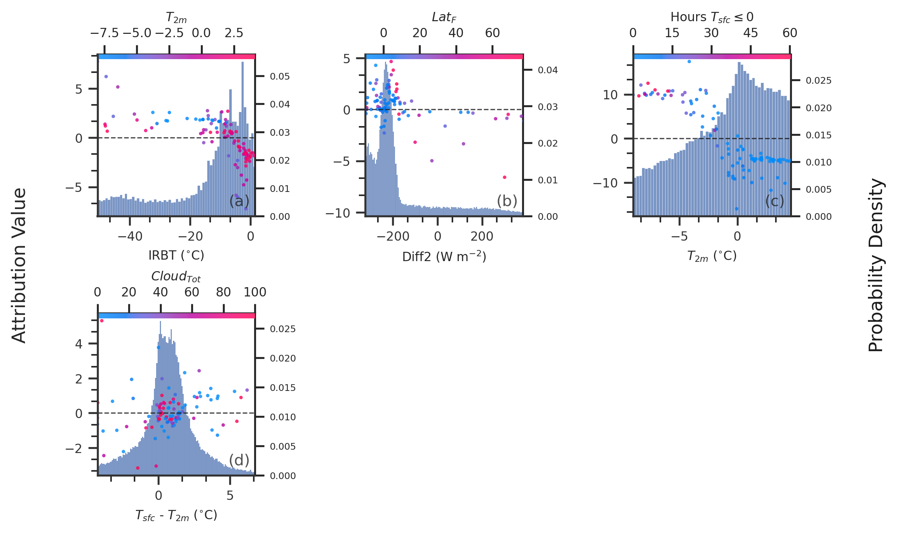

__MintPy__ (__Model INTerpretability in Python__) is designed to be a user-friendly package for computing and plotting machine learning interpretation output in Python. Current computation includes partial dependence (PD), accumulated local effects (ALE), random forest-based feature contributions (treeinterpreter), single- and multiple-pass permutation importance, and Shapley Additive Explanations (SHAP). All of these methods are discussed at length in Christoph Molnar's interpretable ML book (https://christophm.github.io/interpretable-ml-book/). Most calculations can be performed in parallel when multi-core processing is available. The primary feature of this package is the accompanying built-in plotting methods, which are desgined to be easy to use while producing publication-level quality figures. 

The package is under active development and will likely contain bugs or errors. Feel free to raise issues!

This package is largely original code, but also includes snippets from preexisting packages. Our goal is not take credit from other code authors, but to
make a single source for computing several machine learning interpretation methods. 

### Install
MintPy can be installed through pip or conda-forge
```
pip install mintpy
or 
conda install -c conda-forge mintpy
```

### Dependencies 
```
numpy 
pandas
scikit-learn
matplotlib
shap
```


### Initializing MintPy
The interface of MintPy is the ```InterpretToolkit```, which houses the computations and plotting methods
for all the interpretability methods contained within. Once initialized ```InterpretToolkit``` can 
compute a variety of interpretability methods and plot them. See the tutorial notebooks for examples. 

```python
import mintpy

myInterpreter = mintpy.InterpretToolkit(model=model_objs,
                                 model_names=model_names,
                                 examples=examples,
                                 targets=targets,
                                )
```
### Permutation Importance
For predictor ranking, MintPy uses both single-pass and multiple-pass permutation importance method (Breiman 2001; Lakshmanan et al. 2015; McGovern et al. 2019).   

<a href="url"></a>

### Partial dependence and Accumulated Local Effects 
To compute the expected functional relationship between a predictor and an ML model's prediction, you can use partial dependence or accumulated local effects. There is also an option for second-order interaction effects. 

<a href="url"></a>

<a href="url"></a>

### Feature Contributions 
To explain specific examples, you can use SHAP values. MintPy employs both KernelSHAP for any model and TreeSHAP for tree-based methods. In future work, MintPy will also include DeepSHAP for convolution neural network-based models. MintPy can create the summary and dependence plots from the shap python package, but is adapted for multiple predictors and an easier user interface. It is also possible to plot contributions for a single example or summarized by model performance. 

<a href="url"></a>

<a href="url"></a>

<a href="url"></a>

<a href="url"></a>

### Tutorial notebooks

The notebooks provides the package documentation and demonstrate MintPy API, which was used to create the above figures. 


